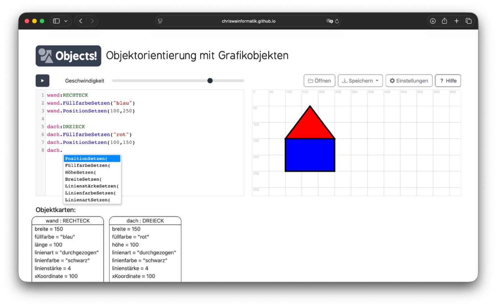

[🇬🇧 Switch to English version](README.en.md)

# Objects!
## **Objektorientierung mit Grafikobjekten**

[](https://github.com/chriswainformatik/objects/releases)
[](https://chriswainformatik.github.io/objects/)

Objects! ist ein browserbasiertes, didaktisches Werkzeug, das einen handlungsorientierten Zugang zu objektorientierten Sichtweisen und Notationsformen ermöglicht. Mit Objects! lassen sich per Textbefehl Grafikobjekte erzeugen und durch Methodenaufrufe manipulieren. Die Auswirkungen der Befehle können in einem Grafikfenster und an Objektkarten beobachtet werden.



---

## 🚀 Schnellstart

Objects! ohne Installation direkt im Browser ausprobieren:

**[Objects! Web App starten](https://chriswainformatik.github.io/objects/)**

---

## ✨ Key Features

- **Visuelle Zeichenfläche:** Macht Änderungen von Attributwerten graphisch sichtbar
- **Objektkarten:** Zeigen immer den aktuellen Zustand der Objekte an
- **Didaktische Syntax & Hilfestellung:**
  - `dach:DREIECK` — Instanziiert das Objekt `dach` der Klasse `DREIECK` und zeigt es an.
  - `dach.PositionSetzen(100, 200)` — Ändert die Attributwerte und aktualisiert die Position auf der Zeichenfläche.
- **Integrierte Hilfe:** Alle verfügbaren Klassen, Attribute und Methoden in der Seitenleiste einblenden.
- **Intelligente Fehlerbehandlung:** Benutzerfreundliche Fehlermeldungen mit konkreten Hinweisen zur Behebung von Syntaxfehlern.
- **Bedien- & Entwicklerkomfort:**
  - Intelligente Code-Vervollständigung.
  - Ein- und ausblendbares Gitternetz und Zahlenwerte
- **Speichern & Exportieren:**
  - Lokale Speicherung von Benutzereinstellungen im Browser.
  - Programme aus lokalen Dateien laden und in Dateien speichern.
  - Programmabläufe als Videodatei exportieren.

---

## 🛠️ Objects! selbst hosten

### Option 1: Manuelle Installation
1. Lade das neueste Release von der [Releases-Seite](https://github.com/chriswainformatik/objects/releases) herunter.
2. Entpacke das Archiv in einen Unterordner deines Webservers oder ein lokales Verzeichnis.
3. Für die lokale Nutzung: Öffne die Datei `index.html` direkt im Browser.

### Option 2: Installationsskript
Führe das automatisierte Installationsskript über die Bash aus:
```bash
curl -sSL [https://raw.githubusercontent.com/chriswainformatik/objects/main/install.sh](https://raw.githubusercontent.com/chriswainformatik/objects/main/install.sh) | bash
```

---

## 🗺️ Weitere geplante Features
 - [ ] Hinzufügen weiterer Methoden (z.B. animierte Bewegung)
 - [ ] Sichtbar bzw. unsichtbar setzen von Objekten
 - [ ] Gruppieren von Objekten
 - [ ] Bühnen-Objekt (z.B. zur Manipulation des Hintergrunds)
 - [ ] Kontrollstrukturen

---

Made with [Bootstrap](https://getbootstrap.com/) and [CodeMirror](https://codemirror.net/)
